# Sistem Manajemen Layanan dan Inventaris Stok Depot Air Minum Isi Ulang (Depot Barokah)

## Identitas
- Nama  : Ega Clearesta Hananta
- NIM   : 2409106088
- Kelas : B'24

---

# Deskripsi Program

Program ini dibuat untuk membantu pengelolaan data pada Depot Air Minum Isi Ulang Depot Barokah.  
Program ini menggunakan konsep Pemrograman Berorientasi Objek (PBO) dengan bahasa pemrograman Java.

Program dapat menyimpan dan mengelola data menggunakan ArrayList serta menyediakan fitur CRUD (Create, Read, Update, Delete).

Data yang dikelola dalam program ini meliputi:
- Data produk depot
- Data layanan isi ulang galon

Program juga memiliki menu interaktif yang dapat dijalankan berulang kali sampai pengguna memilih menu Exit.

---

# Fitur Program

Program memiliki dua menu utama yaitu:

## 1. Kelola Produk
Menu ini digunakan untuk mengelola data produk yang tersedia di depot.

Fitur yang tersedia:
- Tambah produk
- Lihat daftar produk
- Update data produk
- Hapus data produk

Contoh produk yang dapat disimpan:
- Aqua Galon
- Aqua Botol
- Tutup Galon
- Segel Galon

---

## 2. Kelola Layanan Isi Ulang
Menu ini digunakan untuk mengelola data layanan isi ulang air galon yang tersedia di depot.

Fitur yang tersedia:
- Tambah layanan
- Lihat daftar layanan
- Update layanan
- Hapus layanan

Contoh layanan:
- Isi Ulang Ro
- Isi Ulang biasa

#  Output Program

### Tampilan Menu Utama
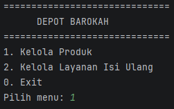

### Menu Produk
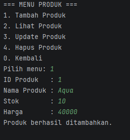

### Tambah Produk
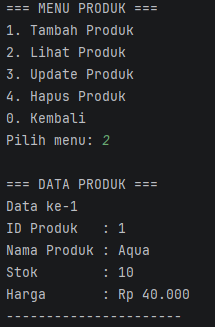

### Lihat Produk
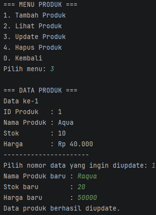

### Update Produk
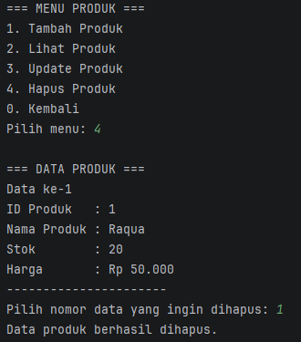

### Hapus Produk
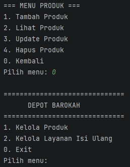

### Menu Layanan
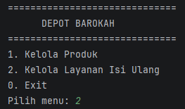

### Tambah Layanan
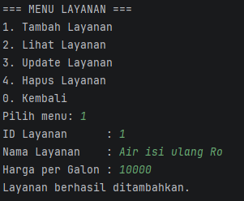

### Lihat Layanan
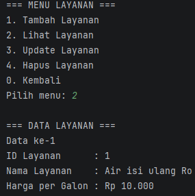

### Update Layanan
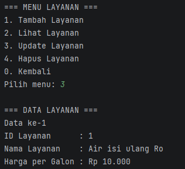

### Hapus Layanan
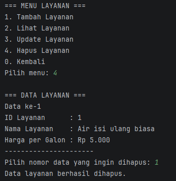

### Program Exit
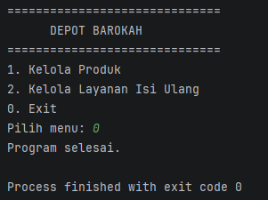